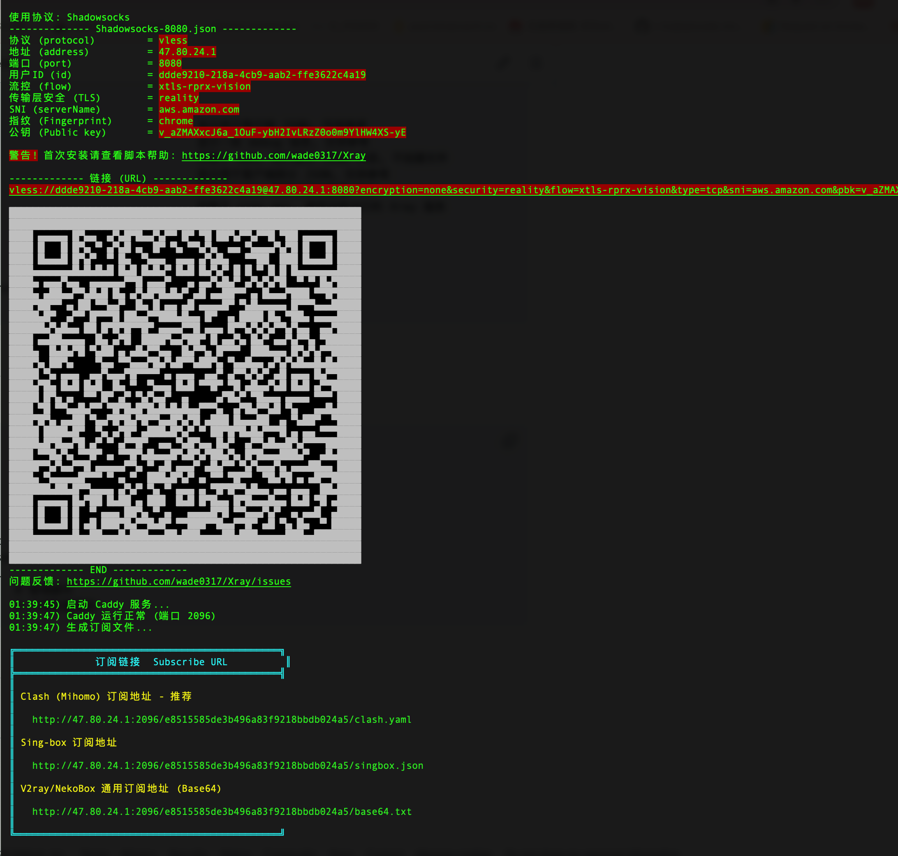

# Xray 一键安装 & 管理脚本

## 功能特点

- 一键安装，零配置上手
- 自动化 TLS（Caddy 自动申请证书）
- 多配置同时运行，支持所有常用协议
- **自动生成订阅链接**（Sing-box / Mihomo / 通用 Base64）
- **添加/删除节点后订阅自动更新**
- **自动管理系统防火墙端口**（ufw / firewalld）
- 支持 API 操作，无需重启即可增删节点
- 查看配置时自动显示节点二维码
- 一键启用 BBR 加速

## 支持协议

| 协议 | 传输 | IP 直连 | 需要域名 | Cloudflare | 说明 |
|------|------|:-------:|:--------:|:----------:|------|
| VMess-TCP | TCP | ✓ | | | 经典协议，无 TLS，不可过 Cloudflare |
| VMess-WS-TLS | WebSocket | | ✓ | ✓ | 兼容性好，Cloudflare 免费套餐可用 |
| VMess-gRPC-TLS | gRPC | | ✓ | ✓ | Cloudflare 需在后台开启 gRPC 支持 |
| VLESS-WS-TLS | WebSocket | | ✓ | ✓ | 兼容性最好，Cloudflare 免费套餐可用（443/80/8443 等端口） |
| VLESS-gRPC-TLS | gRPC | | ✓ | ✓ | 低延迟，Cloudflare 需在后台开启 gRPC 支持 |
| VLESS-XHTTP-TLS | XHTTP | | ✓ | ✓ | 新型传输，行为类似 HTTPS 下载，Cloudflare 可代理 |
| VLESS-REALITY | TCP | ✓ | | | 推荐使用，抗检测能力强，无需域名 |
| Trojan-WS-TLS | WebSocket | | ✓ | ✓ | 流量伪装为 HTTPS，Cloudflare 免费套餐可用 |
| Trojan-gRPC-TLS | gRPC | | ✓ | ✓ | Cloudflare 需在后台开启 gRPC 支持 |
| Shadowsocks | TCP | ✓ | | | 轻量加密代理，支持 SS2022 |
| VMess-TCP-dynamic-port | TCP | ✓ | | | 动态端口，防端口封锁，不可过 Cloudflare |
| Socks5 | TCP | ✓ | | | 本地 SOCKS5 代理，仅供本机使用 |

> **IP 直连**：无需域名，直接用服务器 IP + 端口连接，安装后即可使用。
>
> **需要域名**：使用 TLS 加密，由 Caddy 自动申请 Let's Encrypt 证书，必须拥有**真实域名**并将 DNS A 记录解析到服务器 IP。
>
> **Cloudflare**：需将域名托管至 Cloudflare 并开启代理（小云朵），服务器监听 443 端口。WebSocket / gRPC 免费套餐均可用；使用 gRPC 需在 Cloudflare 控制台「网络」选项中开启「gRPC」开关。

## 系统要求

- 操作系统：Ubuntu / Debian / CentOS
- 架构：64 位（x86_64 或 ARM64）
- 权限：root 用户
- 依赖：systemd

## 安装

### 首次安装

> **系统要求**：推荐使用 **Ubuntu**（已在 Ubuntu 系统上完整测试验证）。需要 **root 权限**，非 root 用户请先执行 `sudo -i` 切换到 root 用户。


#### 非root 用户先切换到 root
```bash
sudo -i
```

#### 通过一键脚本安装
```bash
bash <(wget -qO- https://raw.githubusercontent.com/wade0317/Xray/main/install.sh)
```

安装完成后默认添加一个 **VLESS-REALITY** 配置，并自动：
- 开放对应防火墙端口（如 ufw/firewalld 已启用）
- 生成订阅文件并输出订阅链接

### 更新脚本

如果已安装过脚本，无需重新安装，直接执行以下命令更新到最新版本（节点配置保留不变）：

```bash
xray update sh
```

## 效果预览



## 使用

安装完成后使用 `xray` 命令管理：

```bash
xray [command] [args]
```

直接运行 `xray` 会进入交互式管理菜单：

```bash
xray
```

带参数运行时则直接执行对应命令，例如 `xray add reality`、`xray info`。

交互式主菜单如下：

```text
1. 添加配置
2. 更改配置
3. 查看配置
4. 删除配置
5. 运行管理
6. 更新
7. 卸载
8. 帮助
9. 其他
10. 关于
```

部分菜单还会继续进入子菜单，例如：

```text
查看配置:
1. 查看配置
2. 更新订阅配置

运行管理:
1. 启动
2. 停止
3. 重启

更新:
1. 更新 Xray-core
2. 更新脚本
3. 更新 Caddy

其他:
1. 启用 BBR
2. 查看日志
3. 查看错误日志
4. 测试运行
5. 重装脚本
6. 设置 DNS
```

### 命令行直接运行操作

```bash
# 添加节点（交互式选择协议）
xray add

# 快速添加指定协议
xray add reality          # VLESS-REALITY
xray add reality auto     # 自动参数
xray add ws               # VMess-WS-TLS
xray add vws              # VLESS-WS-TLS
xray add ss               # Shadowsocks

# 查看节点信息 / 二维码 / URL
xray info [name]
xray qr [name]
xray url [name]

# 删除节点
xray del [name]

# 重新生成订阅并显示订阅链接
xray sub
```

### 更新

```bash
xray update sh            # 更新管理脚本（保留所有节点配置）
xray update core          # 更新 Xray-core 内核
xray update dat           # 更新 geoip / geosite 规则库
xray update caddy         # 更新 Caddy
```

### 服务管理

```bash
xray status               # 查看运行状态
xray restart              # 重启 Xray
xray restart caddy        # 重启 Caddy
xray start                # 启动 Xray
xray stop                 # 停止 Xray
xray log                  # 查看运行日志
xray logerr               # 查看错误日志
```

### 其他

```bash
xray bbr                  # 启用 BBR 拥塞控制加速
xray version              # 查看当前版本
xray ip                   # 查看服务器 IP
xray get-port             # 获取一个可用端口
xray ss2022               # 生成 Shadowsocks 2022 密码
```

### 订阅链接

每次添加或删除节点后，脚本自动重新生成以下三种订阅文件：

| 类型 | 适用客户端 |
|------|----------|
| Clash (Mihomo) 订阅地址 - 推荐 | Clash Verge Rev、Mihomo |
| Sing-box 订阅地址 | Sing-box、Sing-box VT |
| V2ray/NekoBox 通用订阅地址 (Base64) | v2rayN、NekoBox 等 |

**IP 直连订阅（默认，无需域名）：**

```
http://{ip}:2096/{token}/clash.yaml
http://{ip}:2096/{token}/singbox.json
http://{ip}:2096/{token}/base64.txt
```

**HTTPS 域名订阅（配置域名后自动启用）：**

```
https://{domain}/sub/{token}/clash.yaml
https://{domain}/sub/{token}/singbox.json
https://{domain}/sub/{token}/base64.txt
```

执行 `xray sub` 可**重新生成**所有订阅文件并显示最新链接，适用于以下场景：

- 更新脚本后（`xray update sh`）需要让新模板规则生效
- 手动修改了订阅模板（路由规则、DNS 配置等）
- 任何想强制刷新订阅文件的情况

```bash
xray sub
```

> 订阅端口默认为 **2096**，Token 在安装时随机生成，存储于 `/etc/xray/subscribe/token`。
> 配置域名后会同时提供 HTTPS 域名链接和 IP 直连备用链接。

### 推荐客户端

| 客户端 | 平台 | 订阅格式 | 下载 |
|--------|------|----------|------|
| [Clash Verge Rev](https://github.com/clash-verge-rev/clash-verge-rev) | Windows / macOS / Linux | Mihomo (clash.yaml) | [GitHub Releases](https://github.com/clash-verge-rev/clash-verge-rev/releases) |
| [Sing-box](https://github.com/SagerNet/sing-box) | iOS / Android / 桌面 | Sing-box (singbox.json) | [GitHub Releases](https://github.com/SagerNet/sing-box/releases) |
| Sing-box VT | iOS | Sing-box (singbox.json) | [App Store](https://apps.apple.com/us/app/sing-box-vt/id6673731168) |

### 订阅模板

订阅配置基于模板生成，模板位于安装目录下：

```
/etc/xray/sh/template/
├── sing-box-vpn.json   # Sing-box 1.11.x 客户端模板（Legacy DNS 格式）
└── clash-vpn.yaml      # Mihomo/Clash 客户端模板
```

修改模板后，执行 `xray sub` 即可立即用新模板重新生成订阅文件，无需新增或删除节点。

### 防火墙管理

脚本自动检测并适配系统防火墙，优先使用已运行的防火墙，无则尝试安装：

| 检测顺序 | 条件 | 处理方式 |
|---------|------|---------|
| 1 | ufw 已激活 | 直接使用 ufw；清除云平台预置的冲突 iptables 规则 |
| 2 | firewalld 已运行 | 直接使用 firewalld |
| 3 | iptables 接管（如 Oracle Cloud） | 清除预置 REJECT/DROP 规则，放行基础端口 |
| 4 | 无防火墙 | Debian/Ubuntu 自动安装 ufw；CentOS/RHEL 自动安装 firewalld |

| 操作 | 防火墙行为 |
|------|----------|
| 安装时 | 检测防火墙类型，开放 22、80、443、2096 端口 |
| `xray add` | 自动开放对应端口（TLS 协议开放 443，直连协议开放监听端口） |
| `xray del` | 检查端口是否仍被使用，无其他配置使用时自动关闭 |

> 云服务器（阿里云、腾讯云、AWS 等）的**安全组规则**需在云控制台手动添加，脚本无法自动配置。

### 完整命令参考

```
基本:
   v, version                                      显示当前版本
   ip                                              返回当前主机的 IP
   pbk                                             同等于 xray x25519
   get-port                                        返回一个可用的端口
   ss2022                                          返回一个可用于 Shadowsocks 2022 的密码

一般:
   a, add [protocol] [args... | auto]              添加配置
   c, change [name] [option] [args... | auto]      更改配置
   d, del [name]                                   删除配置
   i, info [name]                                  查看配置
   qr [name]                                       二维码信息
   url [name]                                      URL 信息
   sub                                             显示订阅链接
   log                                             查看日志
   logerr                                          查看错误日志

更改:
   dp, dynamicport [name] [start | auto] [end]     更改动态端口
   full [name] [...]                               更改多个参数
   id [name] [uuid | auto]                         更改 UUID
   host [name] [domain]                            更改域名
   port [name] [port | auto]                       更改端口
   path [name] [path | auto]                       更改路径
   passwd [name] [password | auto]                 更改密码
   key [name] [Private key | auto] [Public key]    更改密钥
   type [name] [type | auto]                       更改伪装类型
   method [name] [method | auto]                   更改加密方式
   sni [name] [ip | domain]                        更改 serverName
   new [name] [...]                                更改协议
   web [name] [domain]                             更改伪装网站

进阶:
   dns [...]                                       设置 DNS
   dd, ddel [name...]                              删除多个配置
   fix [name]                                      修复一个配置
   fix-all                                         修复全部配置
   fix-short-id [name]                             修复一个旧 Reality 配置的 short_id
   fix-short-id-all                                修复全部旧 Reality 配置的 short_id
   fix-caddyfile                                   修复 Caddyfile
   fix-config.json                                 修复 config.json

管理:
   un, uninstall                                   卸载
   u, update [core | sh | dat | caddy] [ver]       更新
   U, update.sh                                    更新脚本
   s, status                                       运行状态
   start, stop, restart [caddy]                    启动, 停止, 重启
   t, test                                         测试运行
   reinstall                                       重装脚本

测试:
   client [name]                                   显示用于客户端 JSON, 仅供参考
   debug [name]                                    显示一些 debug 信息, 仅供参考
   gen [...]                                       同等于 add, 但只显示 JSON 内容, 不创建文件
   genc [name]                                     显示用于客户端部分 JSON, 仅供参考
   no-auto-tls [...]                               同等于 add, 但禁止自动配置 TLS
   xapi [...]                                      同等于 xray api, 使用当前运行的 Xray 服务

其他:
   bbr                                             启用 BBR, 如果支持
   bin [...]                                       运行 Xray 命令
   api, x25519, tls, run, uuid [...]               兼容 Xray 命令
   h, help                                         显示帮助
```

## 目录结构

安装后的文件位于：

```
/etc/xray/
├── bin/                # Xray-Core 二进制及规则库
├── conf/               # 节点配置文件（每个节点一个 JSON）
├── config.json         # 主配置文件
├── subscribe/          # 订阅文件目录
│   └── {token}/
│       ├── base64.txt
│       ├── singbox.json
│       └── clash.yaml
└── sh/                 # 管理脚本
    └── template/       # 订阅配置模板
```

## 注意事项

### 系统防火墙

脚本自动检测系统防火墙类型（ufw / firewalld / iptables），按实际运行状态进行适配，无需手动干预。

**脚本默认开放的端口：**

| 端口 | 用途 |
|------|------|
| `80` | HTTP / ACME 证书申请 |
| `443` | HTTPS / TLS 协议 |
| `2096` | 订阅链接访问 |
| `3000` | VLESS-REALITY 节点（默认） |
| `8080` | VLESS-REALITY 节点（默认） |

**常用防火墙命令（按系统类型选择）：**

```bash
# ufw（Ubuntu / Debian）
ufw status                        # 查看状态及已开放端口
ufw allow 端口号/tcp               # 手动开放端口
ufw delete allow 端口号/tcp        # 手动关闭端口

# firewalld（CentOS / RHEL）
firewall-cmd --list-ports                            # 查看已开放端口
firewall-cmd --permanent --add-port=端口号/tcp       # 手动开放端口
firewall-cmd --permanent --remove-port=端口号/tcp    # 手动关闭端口
firewall-cmd --reload                                # 重载规则
```

### 云服务器安全组

云服务器通常有**两层防火墙**：系统防火墙（脚本自动管理）+ 云平台安全组（需手动配置）。

| 云平台 | 操作路径 |
|--------|---------|
| 阿里云 | 云服务器 ECS → 实例 → 安全组 → 配置规则 → 添加入方向规则 |
| 腾讯云 | 云服务器 CVM → 实例 → 安全组 → 修改规则 → 入站规则 |
| AWS | EC2 → 实例 → 安全组 → 入站规则 → 编辑入站规则 |
| Oracle Cloud | 虚拟云网络 VCN → 子网 → 安全列表 → 添加入站规则（同时检查网络安全组 NSG）|

**需要在安全组中手动放行的端口：**

| 端口 | 协议 | 用途 |
|------|------|------|
| `80` | TCP | HTTP / ACME 证书申请 |
| `443` | TCP | HTTPS / TLS 协议 |
| `2096` | TCP | 订阅链接 |
| `3000` | TCP | 节点监听端口（默认） |
| `8080` | TCP | 节点监听端口（默认） |
| 自定义端口 | TCP/UDP | 添加节点时按需放行 |

> Oracle Cloud 特别说明：VCN 有**子网安全列表**和**网络安全组（NSG）**两处规则，需同时配置，缺一不可。

## 问题反馈

[提交 Issue](https://github.com/wade0317/Xray/issues)
